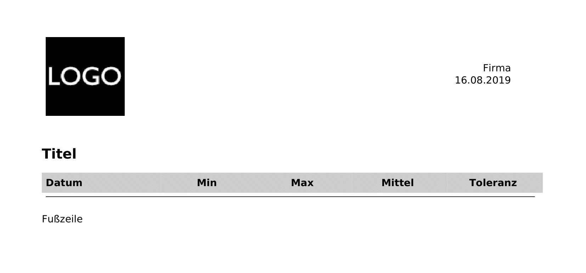

# PDF Report
Dieses Modul bietet die Funktion Archivwerte als Bericht in einer PDF zusammenzufassen. 

### Inhaltverzeichnis

1. [Funktionsumfang](#1-funktionsumfang)
2. [Voraussetzungen](#2-voraussetzungen)
3. [Software-Installation](#3-software-installation)
4. [Einrichten der Instanzen in IP-Symcon](#4-einrichten-der-instanzen-in-ip-symcon)
5. [Statusvariablen und Profile](#5-statusvariablen-und-profile)
6. [WebFront](#6-webfront)
7. [PHP-Befehlsreferenz](#7-php-befehlsreferenz)

### 1. Funktionsumfang

* Ermöglicht das Erstellen und Download von erstellter PDF.
* Einstellung via Instanzkonfiguration
* Logoauswahl für Header ist möglich
* Einstellbare Anzahl Datensätze, Aggregationsstärke, Min- und Max-Werte der ausgewählten Variablen

### 2. Voraussetzungen

- IP-Symcon ab Version 4.0

### 3. Software-Installation

Über den Module Store kann unter der Kategorie "Informationen"=>"Aufbereitung" oder direkt über die Suche nach "Report Modul" das Modul gefunden werden. Durch den Knopf "Installieren" wird das Modul IP-Symcon zur Verfügung gestellt.

### 4. Einrichten der Instanzen in IP-Symcon

- Unter "Instanz hinzufügen" ist das 'Report(PDF)'-Modul unter dem Hersteller '(Gerät)' aufgeführt.  

__Konfigurationsseite__:

Name                    | Beschreibung
----------------------- | ---------------------------------
Logo                    | Auswählbare Grafik als PNG
Firma                   | Firmenname
Title                   | Titel der PDF
Fußzeile                | Fußzeile
Datenquelle             | Variable aus der die Datensätze erstellt werden
Aggregation             | Definiert Aggregationsstufe der aufgelisteten Datensätze (Stunde - Jahr)
Anzahl                  | Anzahl der aufgelisteten Datensätze
Datensatz überspringen  | Ist diese Option aktiviert, wird der aktuellste unvollständige Datensatz verworfen 
Toleranz (Min)          | Akzeptierter Minimalwert der aggregierten Datensätze. Werte außerhalb der Toleranz werden ignoriert.
Toleranz (Max)          | Akzeptierter Maximalwert der aggregierten Datensätze. Werte außerhalb der Toleranz werden ignoriert.

__Beispiel Dokument__
 

### 5. Statusvariablen und Profile

Die Statusvariablen/Kategorien werden automatisch angelegt. Das Löschen einzelner kann zu Fehlfunktionen führen.

##### Statusvariablen
Die PDF wird als "Report (PDF)" generiert.

Name         | Typ    | Beschreibung
------------ | ------ | ----------------
Report (PDF) | Medien | Erstellte PDF, welche über das WebFront heruntergeladen werden kann.

##### Profile:

Es werden keine zusätzlichen Profile erstellt.

### 6. WebFront

Über das WebFront kann die genrierte PDF heruntergeladen werden.

### 7. PHP-Befehlsreferenz

`boolean RAC_GenerateReport(integer $InstanzID);`  
Generiert ein PDF mit den im Modul mit der InstanzID $InstanzID angegebenen Werten. Die PDF steht dann als Mediendatei zur Verfügung.  
Wenn bereits eine Datei existiert, wird diese aktualisiert.
Die Funktion liefert keinerlei Rückgabewert.  
Beispiel:  
`RAC_GenerateReport(12345);`