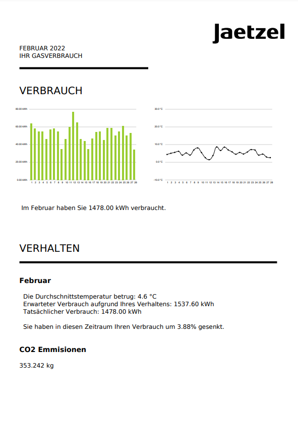

# PDF Report
Dieses Modul bietet die Funktion die Archivwerte zweier Variablen als Graphen dazustellen, und ausgewählte Angabe als PDF für den vergangenen Monat bereitzustellen. 

### Inhaltsverzeichnis

1. [Funktionsumfang](#1-funktionsumfang)
2. [Voraussetzungen](#2-voraussetzungen)
3. [Software-Installation](#3-software-installation)
4. [Einrichten der Instanzen in IP-Symcon](#4-einrichten-der-instanzen-in-ip-symcon)
5. [Statusvariablen und Profile](#5-statusvariablen-und-profile)
6. [WebFront](#6-webfront)
7. [PHP-Befehlsreferenz](#7-php-befehlsreferenz)

### 1. Funktionsumfang

* Ermöglicht das Erstellen und Download von erstellter PDF.
* Einstellung via Instanzkonfiguration
* Logoauswahl für Header ist möglich

### 2. Voraussetzungen

- IP-Symcon ab Version 5.5

### 3. Software-Installation

Über den Module Store kann unter der Kategorie "Informationen"=>"Aufbereitung" oder direkt über die Suche nach "Report Modul" das Modul gefunden werden. Durch den Knopf "Installieren" wird das Modul IP-Symcon zur Verfügung gestellt.

### 4. Einrichten der Instanzen in IP-Symcon

- Unter "Instanz hinzufügen" kann das 'Report (PDF, Multi)'-Modul mithilfe des Schnellfilters gefunden werden.
    - Weitere Informationen zum Hinzufügen von Instanzen in der [Dokumentation der Instanzen](https://www.symcon.de/service/dokumentation/konzepte/instanzen/#Instanz_hinzufügen)

__Konfigurationsseite__:

Name             | Beschreibung
---------------- | ---------------------------------
Logo             | Auswählbare Grafik als PNG
Verbrauchsart    | Freitext welcher unterhalb des Datums steht
Verbrauchszähler | Als Zähler geloggte Variable
Temperatur       | (optional) geloggte Variable
Vorhersage       | Variable, welche den Verbrauch aufgrund des Verhaltens vorhersagen kann
CO2 Typ          | (optional) CO2 Equivalent für die Verbrauchsart

__Beispiel Dokument__

### 5. Statusvariablen und Profile

Die Statusvariablen/Kategorien werden automatisch angelegt. Das Löschen einzelner kann zu Fehlfunktionen führen.

##### Statusvariablen
Die PDF wird als "Report (PDF)" generiert.

Name         | Typ    | Beschreibung
------------ | ------ | ----------------
Report (PDF) | Medien | Erstellte PDF, welche über das WebFront heruntergeladen werden kann.

##### Profile:

Es werden keine zusätzlichen Profile erstellt.

### 6. WebFront

Über das WebFront kann die generierte PDF heruntergeladen werden.

### 7. PHP-Befehlsreferenz

`boolean RAC_GenerateEnergyReport(integer $InstanzID);`  
Generiert ein PDF mit den im Modul mit der InstanzID $InstanzID angegebenen Werten. Die PDF steht dann als Mediendatei zur Verfügung.  
Wenn bereits eine Datei existiert, wird diese aktualisiert.
Die Funktion liefert keinerlei Rückgabewert.  
Beispiel:  
`RAC_GenerateEnergyReport(12345);`
